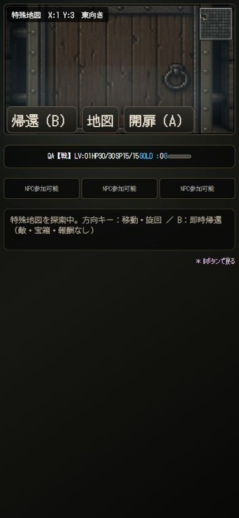

# Phase 3B-2 — Doors Candidate 1

暫定候補。V1正式互換性値としては未凍結。敵・戦闘・報酬・宝箱・扉永続保存は未接続。コミット／pushなし。

## 実装
- js/special-map/doors.js: 純粋な扉生成器。正式 special-map-v1 と既存 phase2a-1 の明示ルーティングを維持。Phase 3A生成器で入力を検証し、壁・入口・出口等は変更しない。
- 既存Mulberry32基盤の独立stream `door-layout` を使用。先に6 + chooseIndex(5)で目標を選び、row-majorのE/S開口候補をFisher–Yatesシャッフル。入口・出口接続edgeは除外。両端セルの占有集合で1セル最大1扉に制限。足りなければそのまま採用し再抽選なし。
- 正規keyは `x,y,E` または `x,y,S`。N/W照会は同一keyへ正規化。署名非依存、Math.random不使用。
- session.js: doorLayout / doorByKey は生成配置、openedDoors Setだけが可変開閉状態。入場時空集合。cells.doorsは両側ともこの集合を読むgetter。セーブ領域は変更なし。
- exploration-ui.js: 閉扉を移動・レイキャストの障害として提供し、既存rendererの通常扉テクスチャと520ms開扉アニメーションを利用。完了後に通過可能。開扉中は移動入力を遮断。
- 既存player.jsの開扉関数は通常奈落のglobal state・イベントへ依存するため呼ばない。共通の描画契約を渡し、特殊sessionだけ更新する。既存door SEをexplorer-preview-ui.js経由で再利用。新規素材なし。
- 入力優先順位: 帰還 → 出口での決定 → 正面隣接扉の開扉 → 移動。Enter / A相当のconfirm / 画面内「開扉（A）」が同じ処理を通る。背後・遠距離の扉は開かない。
- ミニマップは既存drawMinimap / drawDoorMarkをそのまま使用。探索済み側からのみ扉表示。通常扉のclosed/open色を利用。開いた扉は既存の細い枠のみ残り、中央の視界・通過を遮らない。
- inspect-special-map.mjsで配置・枚数・fingerprintを確認可能。fingerprintはソートしたdoor key配列のJSONに既存hash32V1を適用。開閉状態・署名・地形fingerprintを混ぜない。

## 全65,536 seed監査
`node scripts/audit-special-map-doors.mjs`。検査はfail-fast。全件完走、異常0。重複、壁上、外周、不正座標、入口/出口接続、セルへの複数扉、再生成差、署名差を検査。全扉が自由に開く前提の全100マス到達も確認。

|扉数|地図数|割合|
|---|---:|---:|
|0|0|0.000%|
|1-5|0|0.000%|
|6|13033|19.887%|
|7|13228|20.184%|
|8|12982|19.809%|
|9|13292|20.282%|
|10|13001|19.838%|

平均 **8枚**、目標未達 **0件**。

空間指標は配置改善のための観測値であり、追加の配置制約ではない。
- 最小扉間距離（両端セル間Manhattan）: {"1":58075,"2":6840,"3":595,"4":26}。同セル共有は0だが、隣接セルに別扉がある配置は許容。
- 入口から最寄り扉の端セルまでの通路距離: 平均3.756、範囲1～28。
- 出口から最寄り扉の端セルまでの通路距離: 平均5.437、範囲1～34。
- canonical anchorが同じ行に最大6枚: 3地図。同列最大6枚: 1地図。全ヒストグラムはJSON参照。

## 互換性とハッシュ
- Door暫定全seed SHA-256: `6a625e0aac5a8c87367c2ab52e46570dcb195e4260ecb7cacc4f1167c81f693f`
- 連結仕様: seed 0→65535順、各地図のソート済みdoor key配列JSON + LFをSHA-256。
- 正式V1 topology SHA不変: `b985066f1fb5720c8f27c56d925e58d700af9d637d90cd2c6e0fc33ce0920e58`
- 旧phase2a-1 topology SHA不変: `3d92b41f2e2994ca08e40626cd85e498a20c8c0dfc1a135c32472641805df592`
- Candidate 2 ecology SHA不変: `04c4c6902ef72c567a2166d4b4bd41d83b7ca89eab99a8926b0ceaa5d7c96a8a`
- seed12345: entrance (0,2)西 / exit (3,0) / 東向き / torture / topology 65bbb4f0。
- seed12345: door count 7 / door fingerprint 04ec0371。
- positions: (8,0)S, (1,3)E, (8,3)E, (6,4)E, (6,5)E, (5,7)S, (8,7)E。座標0始まり。

## テストと実画面
- 全自動テスト 1,661成功 / 0失敗。新規8件、既存sessionテストを扉付き経路とUIコントローラー検証へ拡張。
- 0/1/12345/65535各100回一致、不正入力、Math.random禁止、canonical edge、閉扉衝突、正面のみ開扉、520ms前は閉、両側参照、再入場closed、署名非依存、ミニマップ未探索非表示・開閉色を確認。
- controller VMでネイティブボタン、Enter、共通confirm、出口優先、renderer復元、normal gameplay非呼出しを確認。既存キーボード/タッチの流出防止と全ゲームパッド回帰テストも成功。
- PCブラウザ: 隔離localhost検証用セーブから正式seed12345へUI経由入場。(1,3)東の閉扉で前進停止、Enter開扉、(2,3)通過、西向きで裏側確認。最短経路を歩き出口(3,0)到達、Enterで奈落入口復帰。
- 390×844ブラウザ: 同地図再入場で同位置closedを確認。画面内開扉ボタン1クリックで開き通過。帰還ボタンで即時入口へ。幅/scrollWidthとも390、ボタン高44px、横はみ出しなし。
- iPhone/USBゲームパッド実機は未確認。390pxブラウザ操作は実機タッチの代替保証ではない。実機確認はユーザー側で実施予定。

## 今回の変更ファイル
- js/special-map/doors.js (new)
- js/special-map/session.js
- js/special-map/exploration-ui.js
- js/explorer-preview-ui.js
- scripts/inspect-special-map.mjs
- scripts/audit-special-map-doors.mjs (new)
- tests/special-map-doors-helper.mjs (new)
- tests/special-map-doors.test.mjs (new)
- tests/special-map-session.test.mjs
- artifacts/special-map-doors-candidate-1.json / special-map-doors-390.png / phase3b2-tests.log / phase3b2-topology-audit.log
- docs/special-maps-phase3b2-doors-candidate1.md

既存の未コミットCandidate 2ファイルは維持し、この作業で生成規則を変更していない。
