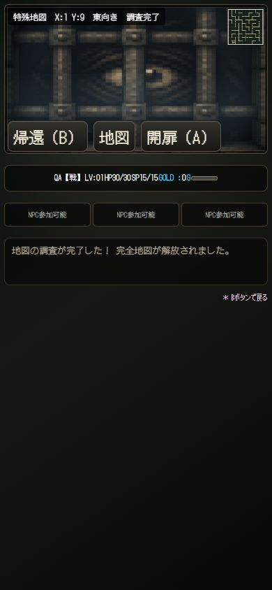
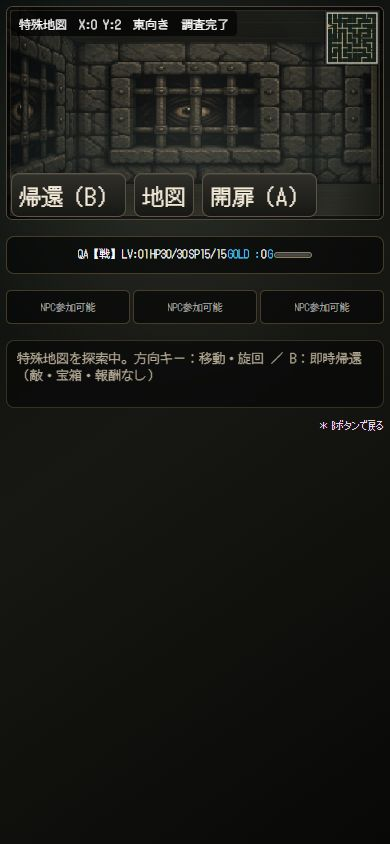

# Phase 3B-3 調査記録・完全地図解放

## 保存構造
登録地図の各原本に surveyedMask（25桁の16進文字列＝100bit）と surveyComplete を保存する。セル番号は y*10+x、文字位置 floor(i/4)、ビットは i%4。調査数はmaskから算出し保存しない。surveyCompleteも正規化時にmaskから再計算するため、不整合な完了フラグを信用しない。

旧セーブ・不正なmaskは全0へ安全に初期化する。鑑定／共有登録で新規所有する地図も全0から開始。地図署名・お気に入りなど従来の所有情報を維持し、dataVersionは追加フィールド互換として1を維持。

原本単位（rulesetVersion + seed + discovererName）のregistered要素に保持。共有コードのpayloadは変更せず、surveyは含まない。完全重複登録では既存記録を維持。削除はregistered要素ごと除去し、再登録で0/100になる。

## runtimeとの分離
- session.explored: 今回実際に侵入したセルのみ。毎回入口1セルから開始。
- session.surveyedMask / surveyView: 永続的な地図知識。ミニマップへの表示専用入力。
- session.pendingSurveyMask: 保存失敗した侵入記録の再試行用。一時状態のみ。
- openedDoors: 従来どおりsession限り。再入場ですべてclosed。
- 位置／向き／開扉状態／generatedMap／walls／door layoutを特殊地図の保存領域へ書かない。

入場時に入口を調査。移動判定でセル侵入が成立した時だけbitを追加する。同じセルへの侵入は増えず、開扉や旋回は調査しない。未調査部分の描画は既存ミニマップへ委譲。100マスでsurveyViewが全trueになり、全セル・壁・通路・扉位置が表示される。runtime exploredは全trueへ上書きしない。

## 完了と出口
99→100の保存成功でsurveyComplete=true。既存メッセージ欄に「地図の調査が完了した！ 完全地図が解放されました。」を一度だけ表示。再入場では通知しない。HUDと詳細画面は調査数／調査完了を表示。

exitの生成値は変更なし。到達時は「出口を発見した。調査を続けられます。」のみ（session内一度）。決定キーで終了せず、移動継続可能。終了は既存の帰還/Bのみ。

## 保存保護
既存transactSpecialMaps → 通常の冒険者セーブスナップショット経由で保存。新規調査bitが増えたときだけ書き込む。更新は既存maskとのORで知識を減らさない。保存失敗時は冒険者・登録地図を旧状態へロールバックし、sessionの確定調査数も増やさない。

未保存の訪問はpendingSurveyMaskへ残し、次の移動／A／帰還で再試行できる。保存できないまま帰還しようとした場合は帰還を止めて案内する。保存成功後は通常どおり即時帰還。強制再読込・ブラウザ終了まで失敗が続いた場合、未確定分は失われるが、最後の正常保存にある原本・調査記録は維持される。

## 変更ファイル（このPhase）
- data/special-map-survey.js: mask純粋関数（新規）
- data/special-maps.js: 正規化、初期値、原本単位の調査更新
- js/special-map/session.js: 永続知識とruntime分離、保存再試行、出口停止解除
- js/special-map/exploration-ui.js: HUD、完了通知、知識ミニマップ、出口通知、保存エラー案内
- js/explorer-preview-ui.js: 保存トランザクション接続、詳細表示、削除注意文
- tests/special-map-survey.test.mjs: 新規6テスト
- tests/special-map-session.test.mjs: 出口継続、通知1回、全地図表示、帰還時保存失敗のテストへ更新
- artifacts/phase3b3-tests.log / phase3b3-layers-audit.log
- artifacts/special-map-survey-complete-390.png / special-map-survey-reloaded-390.png

前Phaseからの未コミット変更は保持。生成器・共有コード・通常奈落処理はこのPhaseで変更していない。

## 検証結果
全自動テスト **1,667成功、失敗0**。

新規テスト: mask検証・旧セーブ、100セル実移動・完了1回、63セル保存→JSON再読込→再入場、扉操作だけでは増えない、保存失敗ロールバック→再試行、共有／別署名／削除再登録。既存UIコントローラーテストにも通知1回・runtime1セル／表示100セル・出口Aで継続・保存失敗時に帰還しないことを追加。

全65,536 seed監査を再実行し、地形・扉・生態系のSHAを確認:
- topology: b985066f1fb5720c8f27c56d925e58d700af9d637d90cd2c6e0fc33ce0920e58
- doors: 6a625e0aac5a8c87367c2ab52e46570dcb195e4260ecb7cacc4f1167c81f693f
- ecology Candidate 2: 04c4c6902ef72c567a2166d4b4bd41d83b7ca89eab99a8926b0ceaa5d7c96a8a
- seed12345 topology fingerprint: 65bbb4f0
- seed12345 door fingerprint: 04ec0371
すべて変更前と一致。監査異常0。

## PC / 390px 実プレイ
隔離したlocalhostの検証用地図・セーブを使用。本番のユーザーセーブは操作しない。

1. 詳細0/100 → 入場1/100。
2. 扉を開いて4セル調査 → 帰還 → 再入場4/100を確認。
3. 全セルをキーボードで歩行。出口(3,0)へ44/100で到達し通知を確認。Enterでも退出せず、その後69→77→98→100と調査を継続。
4. (1,9)で100マス目、完了通知と全ミニマップ表示を確認。
5. 帰還→詳細「調査完了」→再入場、入口(0,2)から全地図表示。
6. (1,3)東扉は同じ場所でclosedへ戻り、前進が止まることを確認。
7. ブラウザ再読込→通常CONTINUEで実セーブを復元。テスト用UI解禁のみ再有効化し、地図データに触れず詳細「調査完了」・再入場全地図表示を確認。
8. 390×844で調査HUDは幅256px、viewport/scrollWidthとも390px。調査率・完了表示・ミニマップ・帰還・扉操作は横はみ出し／重なりなし。

iPhone・USBゲームパッド実機はユーザー確認予定。PCブラウザの入力確認は実機試験の代替保証ではない。

敵・戦闘・報酬・宝箱・NEW GAME+・activeSession永続化は未実装。コミット／pushなし。
